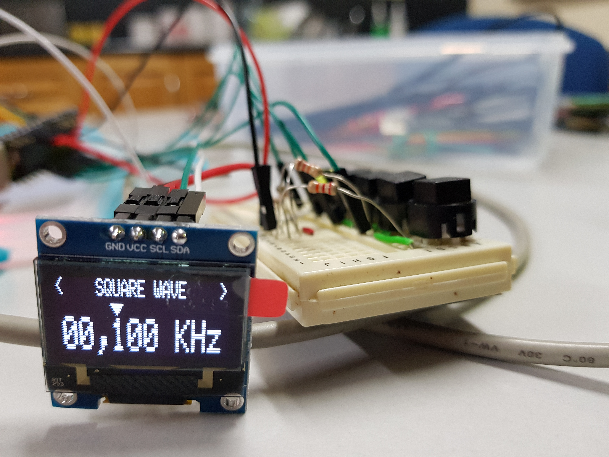
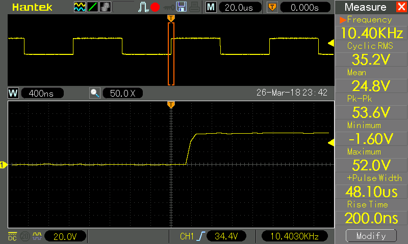
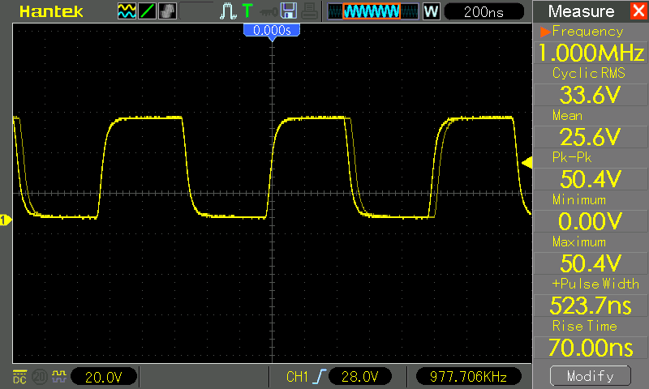

# Arduino Function Generator

A function / signal generator based on the AD9833 function generator chip. It uses an LCD screen to display a waveform menu and output frequency, and has 5 input buttons (up, down, left, right, select) which are 
used to change frequency and waveform. 
There are two Arduino .INO files included; one for an LCD display, and one for an OLED display. Although both have the same result, are written differently to account for different screen behavioiur. 
* function_generator_lcd.ino uses an LCD display and updates only parts of the display that have changed because of a slow, old, LCD driver.
* function_generator_oled.ino is slightly more simple logic flow and updates the whole display with each user input. I would recommend starting with this version and modifying to suit your needs.
 
**NOTE:** This project is still in progress. More detail on the hardware set up to follow.

## Installation
* Download the ZIP file and extract it to your Arduino folder.
* Download and install the AD9833 library here: https://github.com/BasicCode/AD9833-arduino 
Choose an LCD library:
* Download and install the LCD library here: https://github.com/BasicCode/4DSystems_uLCD-144-G1-arduino
* The OLED display uses two libraries from Adafruit (Thanks!). The SSD1306 driver: https://github.com/adafruit/Adafruit_SSD1306 and the graphics routines: https://github.com/adafruit/Adafruit-GFX-Library

## Build
Prototyping on a breadboard the LCD and OLED displays should look like this:
 
128 x 128 px LCD display example  
 
128 x 32 px OLED display example. 

  
TODO: write more the build instructions with pictures

## Testing
The AD9833 datasheet reports an output range of 0 Hz to 12.5 MHz. I found that the output stability and voltage break down quite a lot as frequency approaches 10 MHz, and greatly deteriorate by 12.5 MHz.
The square wave output in particular loses fidelity above about **1 MHz**. 
 
100 KHz triangle wave start-up test signal in this program.  
 
100 KHz sine wave looking very clean.  
 
10 MHz sine wave starting to show some inconsistency.  
 
12.5 MHz sine wave looking very sketchy.  
 
10 KHz low frequency square waves are good.  
 
1 MHz square wave is acceptable.  
 
6 MHz square wave is barely square anymore. 
