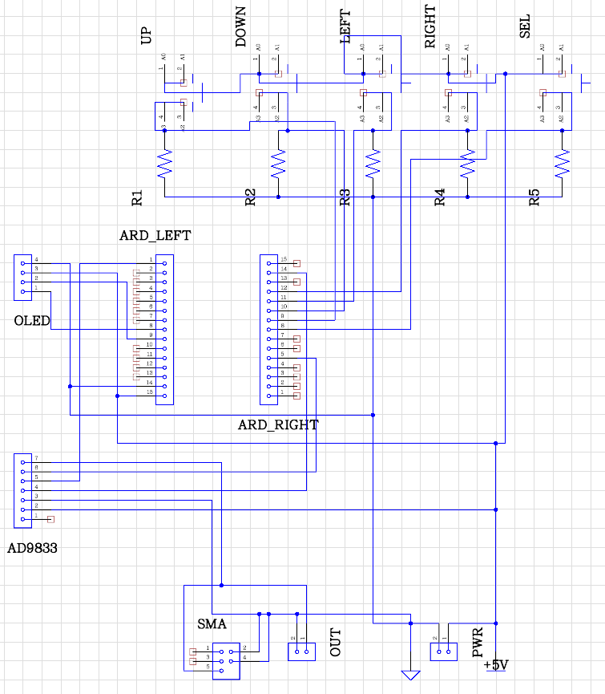
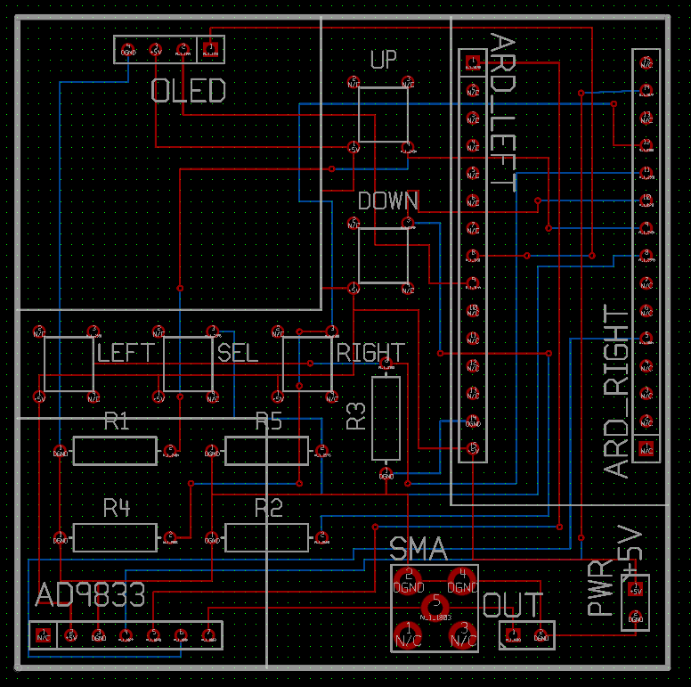
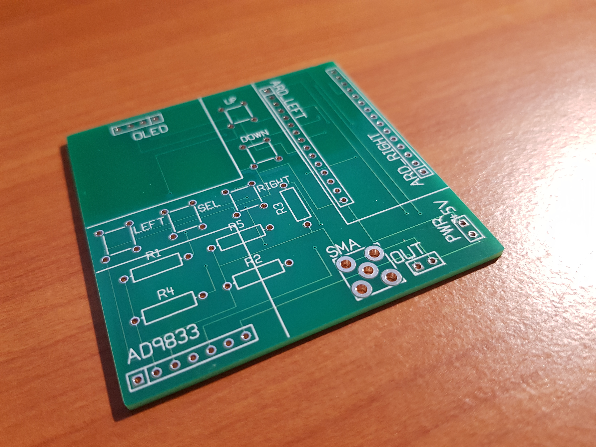

# Arduino Function Generator

A function / signal generator based on the AD9833 function generator chip. It uses an OLED screen to display a waveform menu and output frequency, and has 5 input buttons (up, down, left, right, select) which are 
used to change frequency and waveform. 
**Added in Version 1.1** - Can do "sweep mode" by pressing and holding the select button. This will repeatedly sweep through frequencies starting at the selected frequency up to +1 MHz, or +10 MHz.
 

## Installation
* Download the ZIP file and extract it to your Arduino folder.
* Download and install the AD9833 library here: https://github.com/BasicCode/AD9833-arduino
* The OLED display uses two libraries from Adafruit (Thanks!). The SSD1306 driver: https://github.com/adafruit/Adafruit_SSD1306 and the graphics routines: https://github.com/adafruit/Adafruit-GFX-Library

## Build
### Prototyping
Prototyping on a breadboard looked like this:
 
128 x 32 px OLED display example. 
This works fine and the extra wire lengths do not seem to disturb the output signal. 

### Fabrication
I used a program called pcbWeb (http://www.pcbweb.com/) to design the circuit and PCB, then send the files off to one of the distributors included in the program. The whole process was very easy and the 
printed boards arrived after about 10 days. To my surprise I hadn't made any major mistakes on the board design and the fabrication was flawless. I found that it was cheaper to buy knock-off Arduino Nano
off eBay for about $4 each than to buy the individual AT328, clock crystal, and power regulator, and USB socket components. It looks amateurish but it gets the job done. 
 
Circuit diagram.  
 
Board design.  
 
Printed circuit board.  
 
Final product 

## Testing
The AD9833 datasheet reports an output range of 0 Hz to 12.5 MHz. I found that the output stability and voltage break down quite a lot as frequency approaches 10 MHz, and greatly deteriorate by 12.5 MHz.
The square wave output in particular loses fidelity above about **1 MHz**. 
 
100 KHz triangle wave start-up test signal in this program.  
 
100 KHz sine wave looking very clean.  
 
10 MHz sine wave starting to show some inconsistency.  
 
12.5 MHz sine wave looking very sketchy.  
 
10 KHz low frequency square waves are good.  
 
1 MHz square wave is acceptable.  
 
6 MHz square wave is barely square anymore. 
