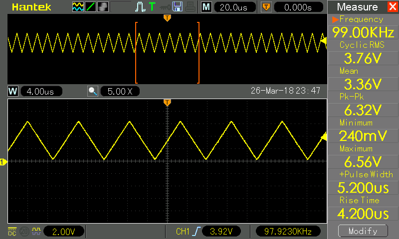
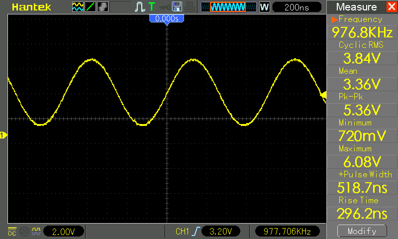
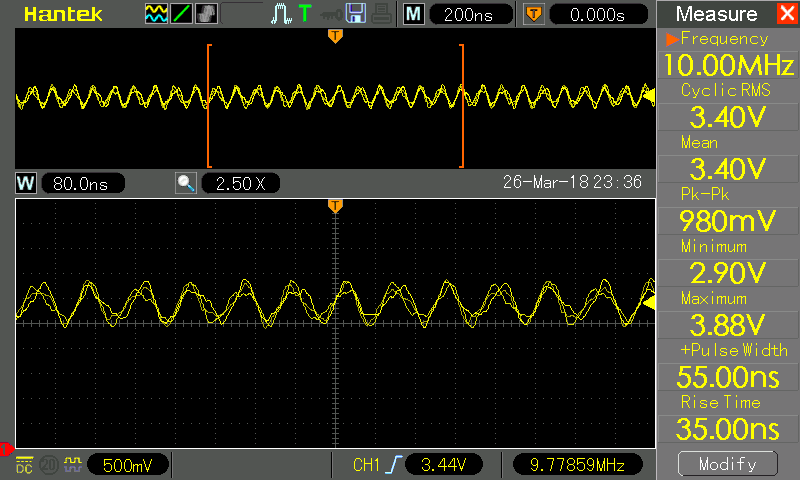
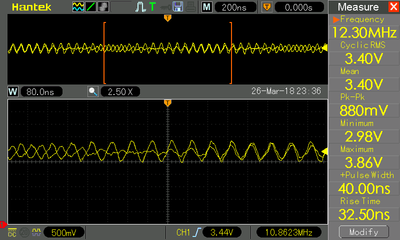

# Arduino Function Generator

A function / signal generator based on the AD9833 function generator chip. It uses an LCD screen to display a waveform menu and output frequency, and has 5 input buttons (up, down, left, right, select) which are 
used to change frequency and waveform. 
The project uses an old (discontinued) LCD screen from 4D systems and so you might want to modify the project with your own LCD and library as needed. 
 
**NOTE:** This project is still in progress. More detail on the hardware set up to follow.

## Installation
* Download the ZIP file and extract it to your arduino folder.
* Download and install the AD9833 library here: https://github.com/BasicCode/AD9833-arduino
* Download and install the LCD library here: https://github.com/BasicCode/4DSystems_uLCD-144-G1-arduino

## Build
TODO: write the build instructions with pictures

## Testing
The AD9833 datasheet reports an output range of 0 Hz to 12.5 MHz. I found that the output stability and voltage break down quite a lot as frequency approaches 10 MHz, and greatly deteriorate by 12.5 MHz.
The square wave output in particular loses fidelity above about **1 MHz**.

100 KHz triangle wave start-up test signal in this program.

100 KHz sine wave looking very clean.

10 MHz sine wave starting to show some inconsistency.

12.5 MHz sine wave looking very sketchy.

1 MHz square wave is acceptable.

6 MHz square wave is barely square anymore.
